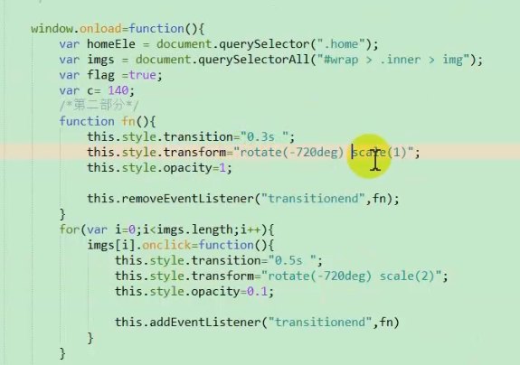
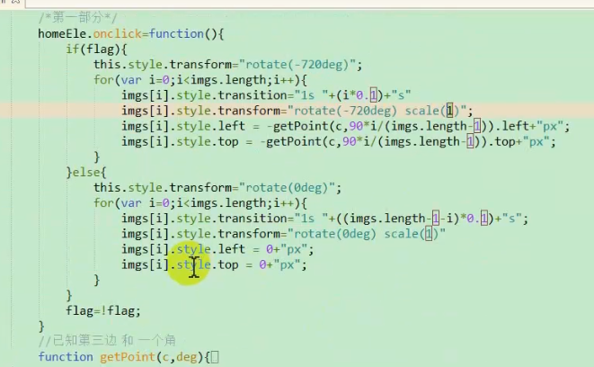
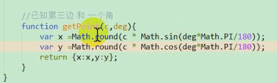

### 1、文本样式

##### 01 自定义字体和字体图标

定义：自定义字体就是UI人员设计的字体，不采用系统自带的字体样式，如TFF格式的字体。

用法：c3提供了一个样式属性如下

````js
<style>
        @font-face {
            font-family: "myFont";//名字可以自定义
            src: url("./font/Ab.TFF");//这里是设计的字体样式
        }    
</style>
````

***字体图标***

想要生成字体图标必须现有矢量图（UI提供的svg格式的文件），然后去`icomoon.io`这个字体图标网站，把矢量图生成字体图标（这个过程就是把每一个矢量图和一个字符去绑定，这样才可以用）。

用法1：把下载好的zip字体图标文件中的fonts文件拷贝到项目中，因为font-face{ }中要写url地址！

​			上下font-family：对应！

````js
        @font-face {
            font-family: 'icomoon';
            src:  url('./icomoon/fonts/icomoon.eot?z9byv6');
            src:  url('./icomoon/fonts/icomoon.eot?z9byv6#iefix') format('embedded-opentype'),
            url('./icomoon/fonts/icomoon.ttf?z9byv6') format('truetype'),
            url('./icomoon/fonts/icomoon.woff?z9byv6') format('woff'),
            url('./icomoon/fonts/icomoon.svg?z9byv6#icomoon') format('svg');
            font-weight: normal;
            font-style: normal;
            font-display: block;
        }
        div::before{
            font-family: 'icomoon'; //和上面对应！
            content: "\e900"; //这个是和矢量图绑定的字符！
        }
````

用法2：引入fonts文件夹和style.css文件！然后需要用到的标签中插入class样式。

##### 02 模糊背景

主要就是插入一个背景图，利用filter属性设置模糊度！filter属性有很多的方法，可以参考菜鸟教程。

````js
.bg{
            position: absolute;
            top: 0;
            right: 0;
            left: 0;
            bottom: 0;
            background: url("./images/logo.png") no-repeat;
            z-index: -1;
            background-size: 100% 100%;
            filter: blur(5px);
}
````

##### 03 文字排版

1)让文字倒序排列，如 你好  变成 好你

````js
direction:rtl;//靠右显示
unicode-bidi:bidi-override;//要配合这个属性使用！
````

2)溢出文字显示省略号...

````js
1.做出下图的效果
{
white-space:nowrap;//强制在同一行内显示所有文本，直到文本结束或者遭遇br标签对象才换行   
overflow:hidden; //溢出的部分隐藏
text-overflow: ellipsis;  //溢出的文本用省略号代替
  /以上三句代码缺一不可/
}
````

### 2、盒模型

##### 01 图片的水平居中

1.图片的默认和基线是有间隙的，可以同 vertical-align这个属性解决！

````js
vertical-align:middle;
````

2.如何设置图片水平居中

在div内创建一个微元素，只有高没有宽，那么同级的img图片就会参考这个伪元素去设置成水平居中了。

第二种方法就是可以img的定位去做，但是这种方法就动了层！

````js
        #dv{
            width: 300px;
            height: 300px;
            border: 1px solid;
            text-align: center;
        }
        #dv:after{
            content:"";
            display: inline-block;//这里要换位行内块，高度100%才有效
            height: 100%;
            vertical-align:middle;
        }
        img {
            vertical-align:middle;
        }
````

##### 02 文字描边和倒影

这2个属性是谷歌有的，-webkit内核才能用，IE和火狐没有这种属性！

````js
-webkit-text-stroke:4px red; //字体的描边
-webkit-box-reflect:below 20px; //倒影，below是向下，above left right;
````

##### 03 resize

作用：允许你控制一个元素的大小（一定配合 overflow:auto）

````
div{
resize:both;//用户可以在水平和垂直方向调整元素的大小
			//horizonta 在水平方向调整
			//vertical 在垂直方向调整
overflow:auto;
}
````

##### 04 box-sizing

````
box-sizing:border-size;就是盒子的内减模式，大小不受padding影响，宽度就是border+padding+width
````

##### 05 BFC

BFC不好定义，但是可以举例说明它的作用。凡是脱离文档流的都可以是产生BFC。

作用:父元素包裹住子元素  ;  兄弟元素之间划清界限 ;

a. 父元素包裹住子元素

````
div
	div

子元素浮动或者绝对定位的时候，那么子元素会脱落父元素，如果还想父元素包裹子元素的话，可以给父元素加BFC
div父{
	 display:flow-root ;
}
````

b. 兄弟元素之间划清界限

````
div
div

2个兄弟元素，第一个左浮动的时候，设置margin-right:10px；是无效果的，这时候可以给第二个元素display:flow-root ;
````

##### 06 禁止系统默认的滚动条

一般我们用滚动条的时候，创建一个div用来模拟滚动条。给html ,body设置高度100%，body里面搞一个容器当滚动条，继承body的高度。高度的100%都是相对于父元素的，而html，body都属于父元素，都要加height

````
        html{
            height: 100%;
            overflow: hidden;//禁止系统的滚动条
        }
        body{
            overflow: hidden;//禁止系统的滚动条
            height: 100%;
        }
        div{
            overflow: auto;
            height: 100%;//要明白滚动条的产生是因为内容超出自身的高度！这里100%，是窗口的高度！
        }
        p{ height: 3000px;}
        
        div
        	p	
````

初始包含块：一个和视窗大小一样大的矩形。

##### 07 移动端用绝对定位代替固定定位！

参考链接：`https://segmentfault.com/a/1190000017891089`

1）绝对定位元素随着滚动条滑动而动 2）绝对定位的元素随着滚动条滑动不动

上面的区别在于包含块的变化！

1、html body 是默认overflow:auto的，所以当内容超过窗口的时候，默认出现系统的滚动条。

2、绝对定位是相对于最近的祖先元素定位的，如果没有就是参照 html body document ，其中html body是默认static的，所以是参照document。

3、当没有禁止html 滚动条的时候，内容超出就会在html上有滚动条，那么滑动的时候初始包含块，这里可以看成document就会向上移动，这时候绝对定位的div就会动了！如果把html的滚动条禁止了，给body加上滚动条，那么这时候div的参照物document就不会动了，也就是初始包含块就不动！那么自然就是代替了固定定位了！

````js
--css部分
        html{
            height: 100%;
            overflow: hidden;
        }
        body{
            overflow: hidden;
            height: 100%;
        }
        .wrap{
            position: absolute;
            left: 0;
            top: 0;
            width: 200px;
            height: 200px;
            background-color: red;
        }
        .dv{
            height: 100%;
            border: 1px solid red;
            overflow: auto;
        }

--html部分
<div class="dv"> //滚动条
    <p style="height: 2000px"></p>
    <div class="wrap"></div>
</div>

上面这种就是移动端常用的绝对定位代替固定定位，把滚动条放在dv上，而html body禁止了滚动条，初始包含块不移动，这时候div的是相对于documet参考的！
````

````js
下面是会移动的，只要html标签上没有禁用滚动条，都会移动
html{
    height: 100%;      
}
````

##### 08 position用法补充

````js
//第一场景
position为绝对定位的时候！上下左右的值为0，相当于四个点在拉，配上margin:auto，就是居中显示！
{
    width: 100px;
    height: 100px; //但是注意这里要有 width height
    position: absolute;
    top: 0;
    left: 0;
    right: 0;
    bottom: 0;
    background: #8ac6d1;
    margin: auto;
}

//第二场景
下面是给父盒子添加遮罩层！铺满！
{
    position: absolute;
    top: 0;
    left: 0;
    right: 0;
    bottom: 0;
    background: rgba(0,0,0,0.2);
}
````

##### 09 backdrop-filter属性

```
.box {
    max-width: 50%;
    max-height: 50%;
    padding: 20px 40px;
    background-color: rgba(0,0,0,0.3);
    border-radius: 5px;
    font-family: sans-serif;
    text-align: center;
    line-height: 1;
    backdrop-filter: blur(10px);
    -webkit-backdrop-filter: blur(10px);
}
```

设置背景或者图片模糊度


### 3、新增UI样式

##### 01 背景

````js

    div{
        background-color:这个属性会被下面的Image压住！
        background-image: url('./img.png'),url('./img.png');//支持多背景图片，但是前面的在后面的上面显示
        background-repeat: no-repeat; //不平铺， repeat-x ,repeat-y
		background-position: top right;/位置写2个，可以写实际距离 10px 20px或者 10% 10%
        注意：position的百分之是相对于，你这个区域的尺寸就是width height 减去背景图片的尺寸，乘百分比！
        
        background-attachment: fixed;//背景固定，当背景图片较大的时候，默认是滚动的 scroll
        background-size:100%
        
    }
	div{ //连写
		background: 背景颜色 URL 平铺方式 背景滚动 背景位置;
		background: #000 url('') repeat-x fixed 10px 20px;
		background: rgba(0,0,0,0.3) //透明度
	}

补充1：插入背景图片的时候，样式记得加 { width:100%; } ,不然不显示大小！

补充2：背景图片按内容裁剪（一般用于点击小图标的时候，点击周围也可以显示点击中）

a链接设置 40 *40
设置padding值 -- >这一步是让背景图片从中间内容开始平铺
background-origin: content-box /*让背景从内容开始平铺*/  border-box从边框框开始平铺
background-clip: content-box; //裁剪！！!
/*默认的就是
border-box  边框以外被裁剪掉
padding-box 内边距以外被裁剪掉
content-box 内容以外被裁剪掉
*/
````

##### 02 线性渐变

渐变是个背景图片，背景图片的属性都可以用！

````js
        div{
            width: 500px;
            height: 200px;
            border: 1px solid red;
            margin: 0 auto;
background-image: linear-gradient(red,yellow,green);默认是从上到下
background-image: linear-gradient(to top,red,yellow,green);//to top ;left;right
background-image: linear-gradient(45deg,red,yellow,green);//度数方向
background-image: linear-gradient(to right,red 20%,yellow 30%,green 50%)
//0-20% 是纯红色； 20%-30% 是红色-黄色的渐变； 30%-50% 是黄色-绿色的渐变；50%以后是纯绿色
background-image: linear-gradient(to right,red 100px,yellow 200px,green 300px);
//这个是用的Px,和上面一样！
background-image: repeating-linear-gradient(to right,rgba(0,0,0,0) ,rgba(0,0,0,1) 250px );//重复渐变，加上repeating,repeating只能重复渐变！！
        }
````

***渐变案例***

画一个黑白相间的发廊灯！

````js
background-image: repeating-linear-gradient(45deg,black 0px ,black 20px ,white 20px,white 40px);

````

##### 03 径向渐变

径向渐变就是以圆心为中心向外渐变，默认是椭圆的渐变形状！

参考链接：https://www.runoob.com/css3/css3-gradients.html

````js
基本语法：
background-image: radial-gradient(red 5%, yellow 15%, green 60%);

修改渐变形状：
background-image: radial-gradient(circle, red, yellow, green);
//circle 修改成圆形的渐变

以什么位置为基准渐变：
background-image: radial-gradient(closest-side circle, red, yellow, green);
//closest-side 以最短的边为目标位置，进行渐变！就比如长方形，中心为原点，离圆点最短的边的距离为半径，渐变！
//farthest-side 最长的边，closest-corner 最近的角，farthest-corner 最远的角

修改渐变圆心位置：
background-image: radial-gradient(closest-side at 10px 20px circle, red, yellow, green);
//at 10px 20px 代表圆形的位置，也可以使用10% 20% 的百分之去设置

重复径向渐变：
repeating-radial-gradient() 
````

### 4、过渡

##### 01 过渡的4个属性

***1) transtion-property***

定义：过渡属性，用于指定需要过渡的属性，默认值是all，例如当鼠标移动到元素上，width需要变化的时候，就是使用这个属性指定width，表示width需要过渡！transtion-property:width;

***2) transtion-duration***

定义：需要过渡的时间。

````js
transtion-property:width,height,background;
transtion-duration:5s,2s;
//上面3个过渡属性，但是下面只写了2个过渡时间，但是这时候会自动复制 5s,2s，就是transtion-duration:5s,2s,5s
// s 这个单位要带上不能直接写数字！也可以写ms(毫秒)
简写：
transtion: all 5s;
````

***3) transition-timing-function***

定义：控制过渡是否匀速、加速等过渡效果。（transiton过渡效果默认是先加速后减速的）

属性值：

````js
transition-timing-function:ease;//默认值（先加速后减速）
linear  //匀速
ease-in  //加速
ease-out  //减速
east-in-out   //先加速后减速
下面是按步数去过渡，比如过渡时间是5S！
step-start  //开始，等同于 steps(1,start)，就是过渡时间要5s,但是这个属性是过渡一开始就完成了过渡效果！
step-end  //结束的时候过渡！就是5s的时候，立即完成过渡效果！等同于 steps(1,end)
step(n)  //按步数来！steop(5)，按5步去过渡！有2个参数，step(n,[start,end]),是start是0s的时候完成第一步过渡！end就是过渡开始1s了，开始第一步过渡！这里根据需求写start还是end 
````

***4) transition-delay***

定义：延迟过渡

````js
transtion-duration:5s;//过渡时间5s
transition-delay:3s;//延迟时间是3s
````

##### 02 过渡用的坑

1） transtion-duration过渡时间需要加 s （秒单位或 ms），不加会失效的！

2）css解析是很快的，下面鼠标进入前系统认为需要过渡的是width,但你移入后系统发现是height，就会立马只有height有过渡效果！然后过渡是进入和出去都是有过渡的，所以在鼠标移除后过渡又只有width才有了！

````js
p{
  transition-property: width;
  transition-duration: 2s;
  transition-timing-function: linear;
}
body:hover p{
   transition-property:height;
   width: 100px;
   height: 100px;
}
````

3）**trasition在首次页面元素渲染未完成的情况下是不能生效的！**

下面开始设置width:100px,js中又设置成了200px，所以首次渲染结束width就是200px！之后才会有过渡！

````js
{
    width: 100px;
    transition-property: width;
    transition-duration: 2s;
    transition-timing-function: linear;
}
--js部分
ele.style.width="200px";

解决方案：
把Js部分放在window.onload=()=>{}中，因为onload就是等DOM渲染完才触发的事件！
````

##### 03 过渡完成事件

过渡完成后都会默认触发时间  ontransitionend 事件。

### 5、2D变换

##### 01 transform

transform 只能用于块级元素。

````js
transform: rotate(90deg);//旋转度数
//位移: translate(10px ,20px) ，还有 translateX()  translateY()
//斜切：skew(30deg)  skewX()  skewY()
//缩放：scale(0.5) 缩小0.5倍!  scaleX() scaleY()
````

 ***transform基点的变换***

````js
--css部分
{
    transform-origin: top left; //transform-origin:20% 30% ;百分比是按照自身元素的左上角！
}
body:hover p{
	transform: rotate(45deg);
}

----

transform-origin:center 100px;//表示变到x轴中间，y轴向下100px为基点！
````

***transform变换的组合***

transform 原理上来讲是从右向左解析的，底层原理是根据矩阵方式去变化的！但是我们为了方便记忆可以从左向右记忆！

````js
表示先向右100px，再缩放0.5，其实位移了125px(这里假设元素大小50px)
transform:translateX(100px) scale(0.5)

先缩小一半，这时候translateX=50px，其实就走了75px（25px+50px）
transform:scale(0.5) translateX(100px)
````

##### 02 扇形导航案例

这个案例是对上面知识点的汇总！







### 6、3D

##### 01 perspective 景深

定义：景深就是肉眼距离显示器的距离，景深越大，元素离我们越远，而且景深都是作用于父元素！

````js
perspective:200px;//这个css要写在父元素
transform-style:perspective-3d;//这个是营造有3d效果的舞台！使效果具有层次感！
````

##### 02  rotate3d()

````js
transform: rotate3d(x,y,z)
rotate3d(1,2,3,30deg);//这种写法就是改变基点再去旋转
````

##### 03 translate3d( )

````js
transform: translate3d(x,y,z)
x,y 可以写百分比，z不可以写，这种可以配合景深去使用
````

##### 04 scale3d()

````js
transform: scaleZ(2) translateZ(100px);//这个实际上是平移了200px，但是要配合景深使用才有效果！
````

##### 05 backface-visibility

隐藏被旋转元素的背面！

比如画一个半透明的正方体，是可以看到背面的图的，用backface-visibility:hidden;就看不到了！

### 7、动画

##### 01 @keyframes关键帧

````js
@keyframes myfirst //myfirst 是 animations 的动画名字！
{
    from {background: red;}
    to {background: yellow;}
}

第二种写法：
@keyframes myfirst
{
    0%   {background: red; left:0px; top:0px;}
    25%  {background: yellow; left:200px; top:0px;}
    50%  {background: blue; left:200px; top:200px;}
    75%  {background: green; left:0px; top:200px;}
    100% {background: red; left:0px; top:0px;}
}
````

##### 02 animation动画

````js
animation-name:myfirst; //动画的名字
animation-duration: 3s; //动画时间
animation-timing-function: linear; //动画效果，是否匀速等，其他属性参照transition-timing-function参数属性！
animation-delay: 1s; //延迟时间
animation-iteration-count:n[infinite]; //动画次数  infinite 无限循环！
animation-direction:reverse[alternate]; //reverse 反向动画 ;alternate 是来回动画，from...to...变得衔接上了！alternate-reverse 是先从to 开始 来回衔接！

animation-fill-mode：backwards[both\forwards]；// 元素form或者to的时候的状态！
//比如：A初始位置在Y轴0px，让它从from -100px to 100px！
backwards就是让动画初始位置在-100px！
forwards 让动画结束位置在100px! 
both是让动画初始和结束在-100px和100px位置！ 
否则默认的情况A初始和结束都是在0px的位置！

animation-play-state:paused[running];// 定义了动画执行的运行和暂停！默认是running！paused 比如是鼠标移动到动画上可以暂停！
````

````js
连写：
		  名字  时间 延迟 匀速    次数       来回动画
animaiton:name 3s   1s  linear infinite  alternate  ;
````

### 8、弹性盒子(flex)

弹性盒子分老版和新版，老版叫box,新版叫flex。

##### 01 容器布局

注意：容器布局的属性是写在最外层包裹的容器上的，不是子元素项目上的！

````js
新版flex
display: flex;
//控制主轴的横纵向
flex-direction: column;//这是容器主轴方向，默认是row 横向;
//column-reverse  是设置主轴元素的排列方向,比如 1 2 3 盒子，用了column-reverse 就成了 3 2 1 排列
//row-reverse  横向控制主轴内元素的朝向，是向左还是向右

//控制盒子的富裕空间，就是项目内盒子间隙的富裕空间！
justify-content: flex-start;//富裕空间在左边 和老版的相反
//flex-end 在右边
//center 盒子在项目的中间
//space-between 两边的盒子顶格，然后剩下的平均分布 ==老版本的justify
//space-around 富裕空间在项目两边 就是平均分布（这个是老版本没有的）

//控制项目盒子的左右上下分布的 （比如项目内有一条上下排列的几个盒子）
align-items: center;
// flex-start 左边 贴着左边排布
// flex-end 右边
// baseline 项目内元素的基线对其的
// stretch 等高布局（前提是盒子是没有height的，用了这个属性就会让盒子继承项目高度100%）
````

````js
老版box
display: -webkit-box;
//控制主轴的横纵向
-webkit-box-orient: horizontal [vertical];//horizontal 纵向 ； vertical 横向

//控制主轴内盒子的方向，类似于flex-direction:column-reverse 的属性！
-webkit-box-direction: reverse [normal];//reverse 纵向 normal 横向！

//控制盒子的富裕空间，就是项目内盒子间隙的富裕空间！
-webkit-box-pack: center;
//start 比如是横向排列的元素，这个富裕空间在右边
//end 在左边
//center 盒子在项目的中间
//justify 两边的盒子顶格，然后剩下的平均分布

//控制项目盒子的左右上下分布的 （比如项目内有一条上下排列的几个盒子）
-webkit-box-align:center //这条盒子在项目的中间
// start 左边
// end 右边
````

##### 02 弹性空间管理

下面的属性是写在项目子元素上的！

就是给盒子的宽度进行富裕空间的分配管理！

````js
新版flex
flex-grow:1; //每个盒子都是一样大小的去瓜分项目横向空间
````

````js
老版box
-webkit-box-flex:1;
````

##### 03 flex新增的属性

***1) flex-wrap***

例子：假设项目宽度100px，有5个50px的盒子，那么盒子就会放不下，但是flex布局会默认自动收缩然后布局在同一行，Box布局就不会，会直接溢出！

flex-wrap属性就是控制盒子是自动收缩还是换行，默认是收缩！

````js
flex-wrap: wrap; //换行 如下图
````


````js
// wrap-reverse 从下开始排布，如下图
````


***补充：flex-flow 属性***

flex-direction 是控制主轴方向和侧轴的朝向的，而flex-wrap是控制是否换行！

flex-flow 是上面2个属性的复用，比如：flex-flow:row-reverse wrap;


***2) align-content***

多行多列的时候看align-content，单行单列的时候看align-items属性！

```
align-content: flex-end;//多行的时候，顶着顶面排布
```


```
align-content: flex-start;//多行的时候，顶着底面排布
```


##### 04 order属性

order值越大越往后排。

```js
#wrap > .item:nth-child(1) {
    order: 3;
}
#wrap > .item:nth-child(2) {
    order: 1;
}
#wrap > .item:nth-child(3) {
    order: 5;
}
#wrap > .item:nth-child(4) {
    order: 2;
}
#wrap > .item:nth-child(5) {
    order: 4;
}
```

上面排序的结果就是按order值排列的！


##### 05 align-self

align-self 会对齐当前flex行中的flex元素，并覆盖 align-items 的值，如果任何flex元素，如果任何flex元素侧轴方向margin值设置为auto，则会忽略align-self。

上面的 align-items 和 align-content 都是管理富裕空间的， 一个是管理单行 一个是管理多行的。align-self 是管理单个元素的

```js
#wrap > .item:nth-child(1) {
    order: 3;
    align-self: flex-end; //看这里，对应看下图
}
#wrap > .item:nth-child(2) {
    order: 1;
}
#wrap > .item:nth-child(3) {
    order: 5;
}
#wrap > .item:nth-child(4) {
    order: 2;
}
#wrap > .item:nth-child(5) {
    order: 4;
}
```


--其他的flex-basis 和 flex-shrink 属性自行百度


##### 06 布局小案例

当项目元素没有设置width的时候，直接flex-grow:1;那么项目元素不是等分布局，是根据内容铺满分布！

```js
--css部分
#wrap > .item {
    /*width: 50px;*/ 
    height: 50px;
    line-height: 50px;
    background-color: pink;
    text-align: center;
    flex-grow: 1;
    /*flex-basis: 0;*/
}

--html部分
<div id="wrap">
    <div class="item">111</div>
    <div class="item">222222</div>
    <div class="item">3</div>
    <div class="item">4</div>
    <div class="item">5</div>
</div>
```


但是如果加了width 或者 flex-basis: 0; 时候就是等分布局了！flex-basis的用法就是先把项目宽度清0，然后所有的 宽度=flex-basis值 0 + 等分布局的宽度！


##### 07 flex简写

```js
flex:1;//这个代表是 flex-grow: 1; flex-basis: 0; flex-shrink: 0; 就是等分布局
```

